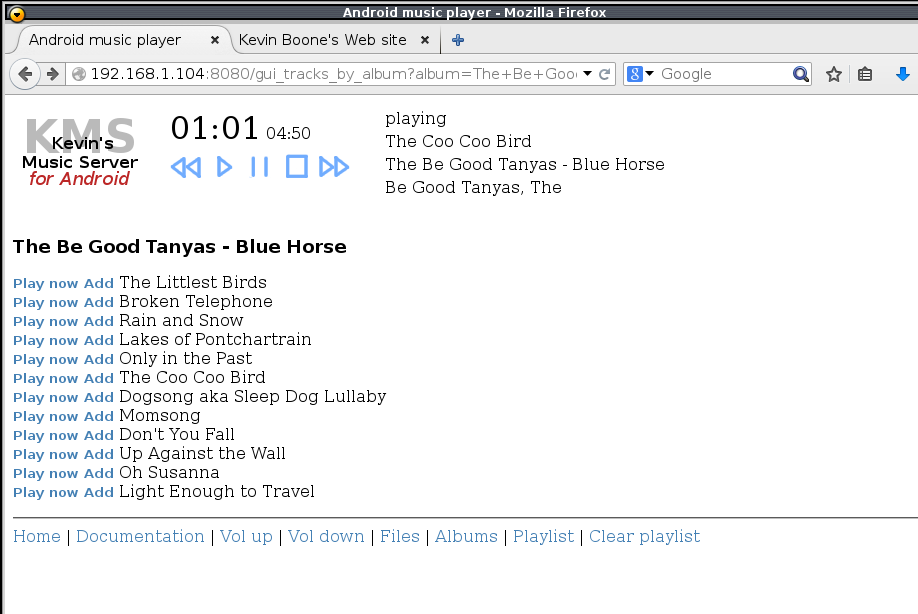
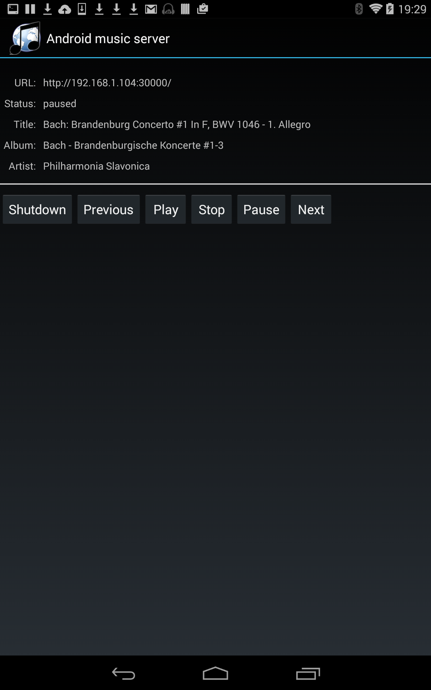

# androidmusicserver

Version 0.0.9, January 2023 

A web interface to the Android audio player -- control your media
playback using a browser.

## Warning -- old, old code

Please note that this app has been largely unchanged since 2015.
I've made only the minimum necessary changes to keep it working 
on the Android devices I own. The most recent device I've tested
is the Samsung Galaxy s10. 

The app has many problems. The genre support that I mentioned as being
problematic back in 2015 remains a problem -- it's shockingly slow
(minutes, with more than a hundred or so albums). This is a crude,
unsatisfactory app, and I only continue to
maintain it because I can't find anything else that does
the same thing. If anybody knows of a superior alternative -- ideally
open-source -- please tell me, so I can let this project quietly
fade away.

Please bear in mind that the latest Android version that this app can
currently target is 4.4 (API level 19). While it does seem to work 
on later devices, this API level is too early for the app to be accepted
by any app store that I know of, even if I wanted to publish it that
way. Although the app builds with the SDK for API level 31, it fails
strangely on many devices.

As I said, this is very old code, that really ought to be allowed to
rest in peace. 

## What is this?

Android Music Server provides a web browser interface to
control playback of audio files stored on most modern (4.x-11.0) 
Android devices. 
This allows the Android device
to be used as a music server, in multi-room audio applications, among
other things. I normally keep my Android phone docked, with a permanent
USB connection to an audio DAC. This arrangement produces good quality
audio playback, but I don't always have the pone within reach. It's
awkward to fiddle with the little screen when it's docked, anyway.
Providing a web interface -- albeit a crude one -- allows me to
control playback from a web browser.

Audio tracks can be selected using the browser from a list of albums, or
directly from the filesystem (but see notes below). 
You can restrict the album listing to particular
genres or particular artists rather than displaying all 
albums on the same page. Album cover
art images can be displayed (but see notes below about this, too).

The browser user interface looks like this:

While the app itself (which will probably never be used, apart from
starting and stopping it) looks like this:

Android Music Server uses no Android feature introduced since about 2015, so
it stands a chance of working on any relatively modern device. The most 
recent reported to work is the Samsung S10, but there's no particular
reason why more recent versions won't work.

Android Music Server is open-source, free of charge, and has no advertisements.
It's easy to build from source if you have the Android SDK available.

## Features
- Simple web interface -- works on most desktop web browsers and many mobile browsers 
- Integrates with the Android media catalogue -- browse by album, artist, genre, composer, or track
- Supports file/folder browsing (if the Android version does)
- Media catalogue text search
- Equalizer
- Cover art (both baked-in and album-folder images)
- Playback control by headset or remote control

## Installation

Android Music Server will never be available from any any app store, because I
can't afford to pay money to distribute stuff free-of-charge. Sorry.

To install, download the APK package from the Downloads section at the
end of this page, copy it to your Android
device, and install it using any file manager. Or simply download the APK
directly from this page using your Android device's Web browser.  
You may have to tell
your device to allow apps from unknown suppliers. If you're worried that this app might
transmit all your secret passwords to villains, you're welcome to inspect
and build the application yourself.

## Building

This version of Android Music Sever is designed be built using gradle, 
the gradle Android plugin, and the Android SDK for API level 19. With these
things all in place, you should be able to build using:

    $ ./gradlew build

You may need to create a `local.properties` file indicating the location
of the Android SDK files:

    sdk.dir=/home/foo/Android/Sdk

A successful build will produce APK files in `app/build/outputs/apk`.

## Permissions 

Android Music Server will request the "Read SD card" permission. In Android
terminology, "SD card" covers both internal and plug-in storage.  

## Operation

Android Music Server is designed to run quietly in the background, so it 
has no complicated Android user interface. When you start the app,
if all is well you'll see the URL to which you should point your web browser.
The Web server listens on port 30000 by default, but this can be
changed from the settings page.
If there are problems, which will generally be network-related, you'll
see an error message. The app displays some information about the audio
track that is currently playing, if there is one, and provides some
buttons to control playback, in a rudimentary way. The "Shutdown" button
shuts the application down completely, including its background
service.

All real operation of the app is from a Web browser. I hope that the
browser interface is relatively self-explanatory -- just select an
album from one of the various lists and click "Play now", or "Add" 
to append the
tracks to the playlist. Alternatively, click the "Files" link at
the bottom of the page and navigate
the filesystem to find some audio files. Or just click "Random" to
play a randomly-selected album.

You can operate Android Music Server using a web browser on the device
itself (if the browser has adequate JavaScript support -- most now do); 
but the app
is really intended to be operated from a browser on a different machine.
It is intended for remote control of music playback; there are many 
good media players for on-device operation. In any event, the
browser user interface may not display very well on a small screen.

Android Music Server responds to remote control events -- from
a bluetooth headset with control buttons, for example. In particular,
it responds to play, pause, step, next track, and previous track events.
Of course, for next track and previous track to work, there must be
something in the playlist. 

## Usage notes 

This app is intended to work with relatively modest
collections of audio files, that are relatively tidily organized. 
All lists (of albums, artists, etc) are displayed on a single,
possibly long page. In practice it seems to work reasonably well
with collections of a few hundred albums, but the user interface
will struggle with thousands of albums, particularly if
you choose to display cover art. The capacity of the
app in this regard really depends on the CPU speed and memory
of the Android device. However, my experience is that even
really fast, modern devices like the Samsung S10 don't devote a lot
of resource to servicing remote clients. 

In general Android Music Server assumes
(as Android generally does) that audio tracks are organized into
albums, and that at least the album, title, and artist tags are
filled in. To play an album in the right order it also assumes that
the track number tag is filled in, or that the titles when arranged
into alphabetical order will give the same ordering as the original
album. Everything about this application will work somewhat better
if files are thoroughly and consistently tagged -- but that's true
of most music players. I'm told that "free music downloaders"
(bootlegging utilities, in other words) do not fill in tags properly,
and you can end up with two thousand tracks in the same album, all
called "null". Still, if you sup with the Devil, as the saying goes,
you're advised to use a long spoon.

The web interface is completely stateless; that is, everything it
needs to know is captured in the URL supplied by the browser. So
you can
freely bookmark albums, or artists, or filesystem locations for
quick reference.

Sadly, filesystem browsing won't work well with Android releases after
6.x or thereabouts -- the ability to read anything other than very
specific locations has been removed. Worse, there's no 
reasonably-straightforward, reliable, 
robust, way to determine which filesystem locations might contain
audio, and be readable. In my darker moments, I think that Google 
is deliberately trying to find new ways to break my apps. In any
case, there's no point complaining to me about this -- go hassle
Google, for what good that will do. In any case, the main page 
presents some fileststem locations that _might_ be readable but,
then again, might not. You'll notice that, when requesting a
file listing, the URL issued by the browser contains the attribute
`path=/xxx`. If you happen to know which directory contains audio
files, and can be read, you can edit (and, presumably, bookmark)
the path manually. For example, if your device supports plug-in
SD cards, the root of the SD card is probably something like
`/storage/XXX-XXXX`, and you might be able to find the value of
'XXXX-XXXX' using a file manager.

When browsing the filesystem (on devices that support this), you 
can add files one at a time to the playlist, 
or add the directory that
contains them. The app will filter out playable audio files from other
types, so it should be OK to click "Add" on a directory with mixed content.
Note that the Add function in a directory only searches that specific
directory -- it won't descend into subdirectories.

If you connect a Bluetooth audio device (e.g., headset) whilst this app is
playing (through speaker or wired headphones), then audio should automatically
be diverted to the headset. However, you might need to stop the app, 
or at least stop playback, to route audio back to the speaker. This slightly
odd behaviour is, so far as I know, not a feature of this program -- other
Android media players behave the same way. 

The browser interface updates every five seconds, so don't expect
mouse-clicks to be reflected immediately in the browser (although,
of course, they should have immediate effect on the audio). This
five-second update time is to reduce load on the Android device.

If you click "Play now" on a track whilst an item in the playlist is being
played, then playback will resume at the next playlist item when playback
of the selected track finishes, if there is anything left to play in 
the playlist.

You can control the volume of playback by clicking on the loudspeaker
buttons in the menu bar at the top of each page, or by going to the
"Equalizer, etc" link from the home page, and tweaking the volume
slider.  
If you're using a headset, it might
have its own volume controls; if it does, it probably sets the
volume on the headset itself, not on the device. So, in that case, 
to get full volume you probably need to turn up the volume both on
the headset and in this application.

Not a feature of this app, but it's helpful to know that some folders that
contain media can be removed from the oversight of the Android media scanner
by creating an empty file called `.nomedia`  in those directories.
This can be useful for preventing ringtones and the like from appearing
in the album list; but bear in mind that this trick affects all apps
that use the media scanner.

## Cover art

If you choose to browse albums including covers, then the
app will attempt to find some cover art to display. The places it
looks are as follows.

First, the app will ask the Android media catalogue if any track in
the specified album has an embedded image. If it does, then the first
track that can provide an image does so. In practice, the Android media
catalogue seems to be limited to returning "baked in" images, that is,
images that are part of an ID3 tag or similar.

Second, the app will look in the directory that contains the track file, for
an image file that looks like it might contain cover art. At present, it
considers files names `folder` or `cover`, perhaps
with a leading "." (hidden files), and with extensions `.jpg` or `.png`. 
These names are in lower-case only. Naturally,
this process will only produce good results if folders contain only tracks
from the same album.

The cover art extraction process is
subject to a number of limitations.

First, baked-in cover-art images can be quite large -- perhaps even photo-sized.
Returning all the images on a page containing, say, a list of two hundred
albums is a challenge for an Android device. If the browser is also on a
mobile device, then the difficulty is compounded. The music server therefore
attempts to avoid sending images if it can avoid doing so. It sets
an `Expires` header one hour in the future for all images, 
and sets a
`Last-Modified` header on all images based on the time the 
app starts up. In
principle, therefore, the browser should not request images very 
frequently. But...

Second, mobile browsers in particular are often stupid when it comes to
handling date headers. Many ignore them completely, and just blindly
request all images in every page. Apart from choosing to browse without
covers, there's little that can be done to avoid this problem, if you
have a stupid browser.

Moreover, we don't know the actual last-modified 
time of a baked-in cover image, because it isn't stored. The
music server uses its start-up time as the modification baseline, lacking
any better information. What this means is that if you restart the app
whilst the browser still has images in its cache, the browser will get
confused: because the image has a last-modified date in the future, but
in the browser's cache it has not yet expired.
Clearing the browser cache usually fixes this
problem. 

## Genre support

Android Music Server provides a list of genres, to make it easy
to restrict the listing of
albums to specific genres. Needless to say, for this to work the audio
files must have valid genre tags. It doesn't really matter what they
actually are, but they must at least be meaningful to the user.

Querying the Android media catalogue for genre information is 
_excruciatingly_
slow. I believe that there is some problem with the internal search
 implementation,
which seems to require the whole genre catalogue to be expanded into tracks
and then a query run against each track. Whatever the reason, with large
numbers of tracks (more than a few hundred) some short-cuts have to be
taken. The app therefore assumes that each track in an album has
the same genre and, when searching which albums match a genre, only the
first track is checked. Of course, it's not all that unusual for 
different tracks to have different genres in the same album, but testing
them all is simply unfeasibly slow in Android.

Genres that have no associated tracks are silently ignored.

## Artist support

When an entry is selected from the Artist list, any album that contains
at least one track attributed to that artist is included in the 
album list. That is, an album doesn't have to be limited to a single
artist to be included in that artist's listing. 

It's not at all uncommon for an album to contain tracks by many different
artists. If many albums are of that type, the artist list could be very 
long.

Android Music Server is entirely at the mercy of the Android media scanner,
when it comes to figuring out which tag in the audio file actually 
represents the artist. Many tag formats, particularly ID3v2, allow
multiple artists, of multiple tasks. If all these tags are filled in,
it's essentially pot luck which one will be used.

## Playlist operations

On the Playlist page you can shuffle or clear the playlist, if 
it is not empty. Clicking either of the relevant links causes the
page to refresh but, because the HTTP requests made using JavaScript
are asynchronous, it can't be guaranteed that the playlist has changed
on the server before the page is refreshed. You might need to refresh
the page explicitly if changes to the playlist do not show up
immediately. 

Shuffling only changes the order in which items appear in the playlist --
if something is playing when you shuffle, the change in ordering will
only be apparent when that track is finished.

## Settings

The settings page (in the app's user interface, not the browser)
provides some modest control over operation of
the app -- the number of items displayed on each browser page, for
example. There is no easy way to guess the appropriate settings --
they depend on the capabilities of the Android device and of
the web browser in use. If you are primarily interacting with the
music server through a desktop browser, for example, you'll probably
be able to set higher values of the number of items on each page.

As with most Android settings pages, the changed settings take effect
when you click the "back" button to get back to the main screen.

## Search

There is a search box in the top menu bar of the web interface. 
The music server does
a very simple, case-insensitive search for the text string, 
which may appear anywhere
in any album, artist, composer, or track title. The number of matches 
of each category (album, artist, etc) that are displayed on 
the results page can be controlled using the
Settings page.

## Android media catalogue issues

Android maintains a catalogue of media files and their metadata (tags).
When a file is added using a USB connection, or presented to the
device on an SD card or similar, Android reads the metadata and updates
the catalogue. Android Music Server relies entirely on this catalogue
for information about albums, artists, etc. Two problems arise from the 
app's use of the media catalogue.

First, the application has to scan the catalogue to get lists of
albums, artists, etc., for the display. This process is not usually
_very_ time-consuming, but not something that we want to do regularly.
In principle, the music server could hook into the media scanner and
rescan every time a file is added or deleted, but many files will be of
no interest to the application (documents, pictures...), and rescanning
like this could be overzealous. Instead, there is a link on the 
home page 'Rescan the media catalog.' This will cause the music server
to rebuild its own lists of albums, artists, etc., from Android's catalogue.
Of course, you could just restart the app.

The second problem is that the media catalogue can sometimes get 
out-of-sync with the contents of storage. This isn't usually a problem
with files added by USB, but can be a problem with files on removeable
storage devices, and is particularly a problem if files are moved
around using a general file manager (or, worse, at a command prompt,
although most users probably won't do that). 

The link 'Rescan the filesystem' will ask Android to start a complete
rescan of the filesystem. Android is completely at liberty to 
ignore this request and, in later versions, is increasingly willing to exactly
that.
With Android 5 and later, rebooting may be the only way to force a complete
rescan. Note that the Music Server user interface will not wait
for the rescan, and rescanning the filesystem does not imply that the
music server app will rescan Android's media catalogue 
(because it has no way to know when the filesystem
rescan is finished, if it even started.) 
 
## Supported devices

Android Music Server is known to work on at least the following 
devices. Feel free to report others that work or don't work.

 - Samsung Note 8, with Android 9.0
 - Google Nexus 7 second gen., with Android 4.4.4
 - Google Nexus 7 first gen., with Android 5.1.0
 - Samsung Galaxy S3, with Android 4.4.2
 - Samsung Note 3, with Android 4.4.2

## Limitations

In general, Android Music Server supports whatever audio formats
the device itself supports. When listing audio tracks by album/artist/etc
you should never see anything that can't be played (unless it's actually
a movie that Android has incorrectly identified as music). When listing
files on the filesystem, you should also never see files that can't
be played, 
because the app won't display files whose
names do not end in a recognized audio extension, like .MP3 or .FLAC -- 
it's just
too time-consuming to have to scan each file and try to work out
its contents. This does mean that some files that could, in fact,
be played never get listed.

The are particular issues regarding the display of cover art: please
see the section "Cover art" above.

Some Android devices are factory-configured to prevent _any_
incoming network connection. Sorry but, without rooting the device,
there's no way to change that, and this app simply won't work.
Similarly, if your Android implementation shuts down the WiFi radio
to save power when the screen blanks then, again, this app won't work.

Android Music Server relies heavily on JavaScript to create and manage its
web user interface. Your browser needs decent JavaScript support --
the browser on the android device itself might not be up to the job
(but Chrome, at least, seems to work pretty well.) 

Only WIFI operation is supported -- you won't be able to connect to the
app over a mobile network. Even if the app allowed this, most likely
the network would not.

The app will not respond very well to changes in WIFI status -- if you
change access points, for example -- and you'll probably need to restart
it in such cases.

Android Music Server relies for its tag (e.g., album) 
support entirely on the Android
media scanner. If this isn't working (which is relatively common), 
results will be variable. The app queries the media scanner
when it starts, so media added after starting may not be visible (even
if the scanner is working), unless you click the "Rescan media catalogue"
link in the home page. Please see the section 'Android media 
catalogue issues' for more information. 

One particular oddity of the Android media scanner is that it will sometimes 
present video files as 'Music,' presmumably because they have soundtracks.
This app doesn't play video, so these entries in the album list are an
irritation.

Whilst you can skip forward and back between tracks in the playlist,
there is no general foward/rewind facility within a specific
track. This is a tricky thing to implement within a web interface.

The app does not choose an open port for its built-in web server --
this would be easy to implement, but users would probably prefer
the port number to remain the same between sessions. If the port number
clashes with something else, or is out of the permitted range, an
error message should be displayed.

There is quite a subtle limitation inherent in the way 
Android audio works. Android Music Server registers itself to receive
remote control events (e.g., from a headset), but <i>only when audio
is playing</i>. So you can select play/pause, next track, and previous 
track, if your headset has buttons for these functions. However,
if you do a "stop" operation (if your hardware supports it), you
won't be able to start again, or use remote control at all,
until you resume playback using the web interface. The reason this limitation
exists is that the app is designed to run in the background, and perhaps
be idle a lot of the time. If it took over the remote control when it 
was running, it would prevent other media apps using the remote control.
There are, in fact, a number of popular media players that suffer from
this exact problem, and it can be quite a nuisance.

*This app is, in essence, an unsecured web server*. 
It is not really intended for use in hostile environments.  

The user interface is currently English-language only.

The part of Android Music Server that responds to HTTP requests and plays
audio (i.e., most of it) is implemented as an Android background service.
It is therefore less prone to automatic unloading than the user interface
is. It's possible that Android might unload the user interface, whilst
leaving the service running. This should be harmless, because when you
restart the app, Android will not restart the service if it is still
running. It's possible, in conditions of low memory, that Android will
unload the service as well. In that case, Android is supposed to reload
it when conditions improve, without user intervention. That process should
also be transparent to the user except that, of course, whilst unloaded
the service will not respond to HTTP requests. However, if the service
is unloaded and reloading in this way, it will reinitialize, and 
the current playlist will be lost.

The Android API specifies an interface by which app can control audio equalizer
settings, but manufacturers do not have to implement it in any useful way.
That is, the controls may not be connected to anything. "Bass boost" is
particularly flakey -- on some devices it has an adjustable strength, 
on some it is just an on/off control, and on some it has no effect at all.
Devices that provide their own, vendor-specific audio enhancers frequently
do not implement the Android audio API at all.
In any event, I am aware of few Android devices where the stock equalizer really
works well. On some devices, I'm told that the equalizer API does not even
initialize properly. 

Albums and tracks that appear in the search results are displayed either
with, or without cover art -- the default is without. However, if you
have recently browsed albums or tracks by cover, then covers will
be included in search results as well. 

Finally, in this long list of limitations, there's the fact that
changing the orientation of the device (portrait/landscape) will
probably cause the app to reload. Because it's deliberately completely
stateless, this will clear the playlist and stop playback. So long
as the UI isn't actually visible -- and, frankly, it's nothing much
to look at -- this isn't a problem.

## Legal and copying

Android Music Server is open-source, and released under the terms
of the GNU Public Licence, version 3.0. It contains components from
a number of different authors. Please see the individual source
files for detailed licencing and redistribution rights. 
The button icons are from the Tango icon set, released under the
germs of the GNU Public Licence, version 2.0.

Broadly, 
however, Android Music Server is free of charge and may be freely
copied and distributed, so long as the original authors continue 
to be acknowledged. 

I wrote Android Music Server server for my own use; I'm 
publishing it in case somebody
else might get some benefit from it -- even if it's only to look at the source
code and see how not to write an Android app. It might work for you, it
might not. If it doesn't, you're very welcome to fix it. 

<h2>Revision history</h2>

<table cellpadding="5px">
  <tr>
    <td valign="top">
      0.0.8
    </td>
    <td valign="top">
     January 2023
    </td>
    <td valign="top">
      Refactored for gradle build and API 31 
    </td>
  </tr>
  <tr>
    <td valign="top">
      0.0.7
    </td>
    <td valign="top">
      November 2021
    </td>
    <td valign="top">
      Improved app screen layout a little
    </td>
  </tr>
  <tr>
    <td valign="top">
      0.0.6
    </td>
    <td valign="top">
      October  2021
    </td>
    <td valign="top">
      Stopped the app crashing when a genre is "null" in the
      media database. 
    </td>
  </tr>
  <tr>
    <td valign="top">
      0.0.5
    </td>
    <td valign="top">
      June 12 2019 
    </td>
    <td valign="top">
      Various bug fixes related to later Android releases
    </td>
  </tr>
  <tr>
    <td valign="top">
      0.0.4
    </td>
    <td valign="top">
      April 18 2015 
    </td>
    <td valign="top">
      Added search facility, and preferences page 
    </td>
  </tr>
  <tr>
    <td valign="top">
      0.0.3
    </td>
    <td valign="top">
      April 15 2015 
    </td>
    <td valign="top">
      Added on-device status display and controls, and equalizer page 
    </td>
  </tr>
  <tr>
    <td valign="top">
      0.0.2
    </td>
    <td valign="top">
      April 12 2015 
    </td>
    <td valign="top">
      Added preliminary cover art, and genre/artist filtering support
    </td>
  </tr>
  <tr>
    <td valign="top">
      0.0.1
    </td>
    <td valign="top">
      April 3 2015 
    </td>
    <td valign="top">
      First release 
    </td>
  </tr>
</table>

## Download

[Download APK](apk/app-debug.apk) (on GitHub, click "View raw" to get the actual APK file)

